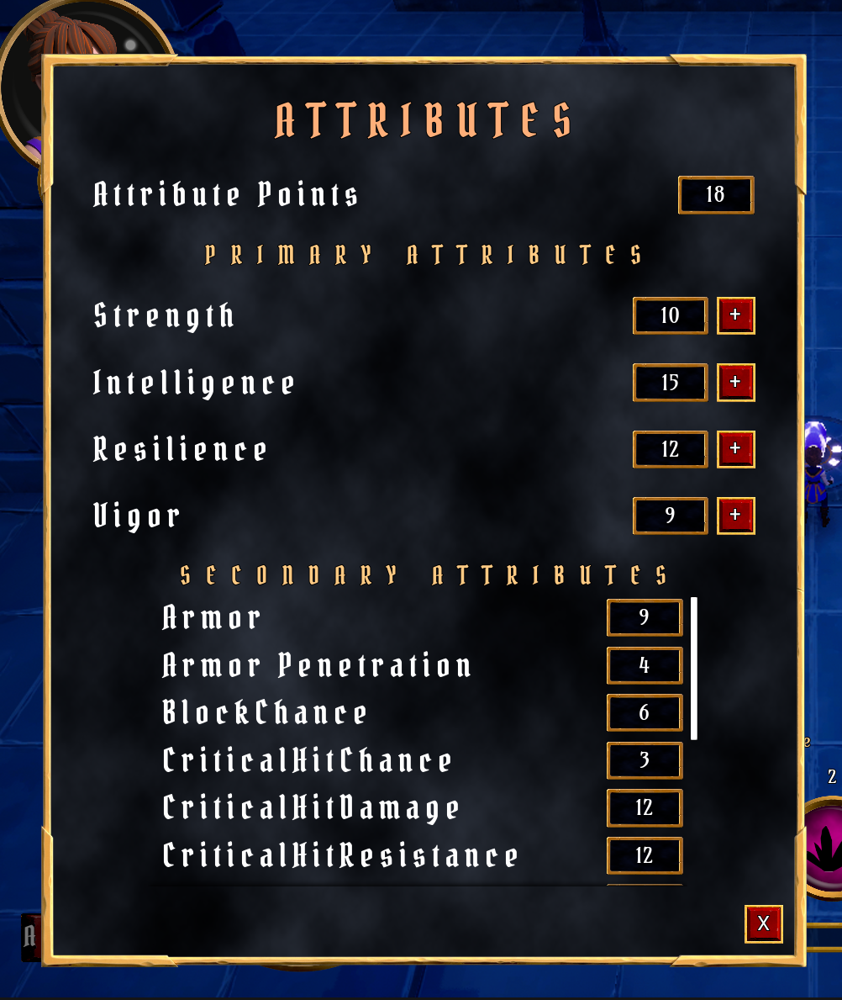

# Aura - TopDown RPG (Diablo-Like)

## Description
Project that implements an RPG ability system through UE "Gameplay Ability System". The objective was to obtain extensive knowlendge on intermediate-to-advanced engine functionalities, patterns and best-practices.
What is part of the code:
- Unreal Engine's Gameplay Ability System
- Multiplayer Gameplay Mechanics
- Solid coding principles and AAA quality code architecture
- Scalable, modular, maintainable, and expandable code
All logic contained inside the project was self-developed.

## Features
The project covers most of functionalities needed for a complete top-down, diablo-like, RPG game.
- Player movement, animation.
- Player stats, associated **Gameplay Tags** and **Ability System Component**.
- Collectable Items with associated Gameplay Effects (Instant, Duration, etc.).
- Combat system based on **physical hits** (hitbox, weapon and animation montages) and **spell abilities**

- Experience and Level Ups. Game progression with increasing attribute points and new unlockable/upgradable spells.
 
  
- Enemies, each one with different, **data-driven**, **abilities** and **stats**.
  - **CurveTables** and **DataAssets**
- Enemy AI using BehaviorTrees.
- Game saves and in-level checkpoints, with also **world state** save/load.
  - Standard Unreal **SaveGame**s and

## Credits

All assets used were provided by the Udemy Course [Unreal Engine 5 - Gameplay Ability System - Top Down RPG](https://www.udemy.com/course/unreal-engine-5-gas-top-down-rpg/)
